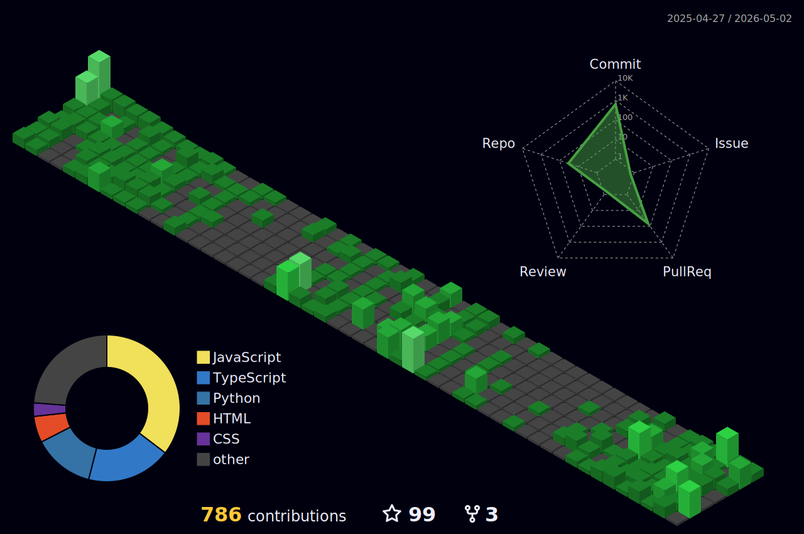

<h1 align="center">Hi, I'm Aayush Chhetri 👋 </h1>

  IT Student at ISMT with a growing interest in web development, graphic design, and Python, currently learning and exploring how to build full stack web applications, backend APIs, and basic AI/ML systems. Familiar with technologies like Python, JavaScript, React, Node.js, Express, Django, and MySQL, and gradually developing skills in tools such as Git, Linux, and Docker. Passionate about learning new technologies, improving problem-solving abilities, and understanding how modern applications and systems are designed and built in real-world environments.

 

📈 Activity Graph

  

📊  GitHub Analytics

  

